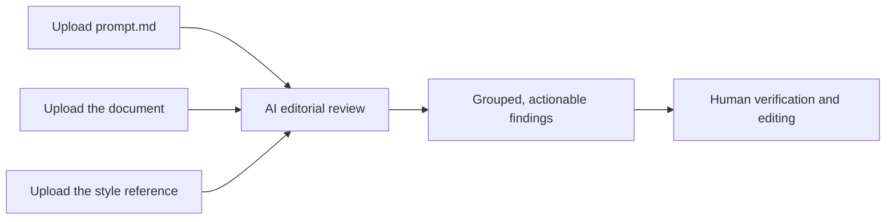

# IAEA Publication Review Assistant

> A reusable AI prompt for identifying actionable editorial and formatting issues in English-language documents using the IAEA Style Manual.

[](prompt.md)
[](IAEA_Style_Manual.pdf)
[](#what-it-checks)
[](#important-notice)

This repository provides a structured prompt that turns a file-capable AI assistant into a focused editorial reviewer. It is designed to flag concrete IAEA style issues, consistency problems, and items that require verification without filling the review with general writing advice.

<p align="center">
  <a href="https://github.com/Brisagr0312/IAEA-Formatting-check-prompt">
    
  </a>
  <br>
  <strong>Scan to open this repository</strong>
</p>

## Why use it?

Long technical documents are difficult to review consistently. This prompt gives the AI a narrow editorial role, a defined classification system, and a repeatable reporting format.

| Without a structured prompt | With this prompt |
| --- | --- |
| Broad rewriting and subjective advice | Actionable editorial findings |
| Unclear or invented rules | Confirmed issues separated from items requiring verification |
| Repeated comments for the same problem | Consolidated findings grouped by category |
| General quality assessments | Specific corrections or verification actions |

## Quick start

You need an AI tool that supports document uploads and can read PDF and Markdown files.

1. Download or clone this repository.
2. Start a new conversation in your AI tool.
3. Upload the document you want reviewed.
4. Upload [`prompt.md`](prompt.md).
5. Upload [`IAEA_Style_Manual.pdf`](IAEA_Style_Manual.pdf), or the current style reference approved for your work.
6. Send the following instruction:

```text
Follow the instructions in prompt.md. Review the attached document against
the attached IAEA style reference. Report only actionable findings and use
the required output format.
```

For a long document, review one chapter at a time. This usually produces more precise findings and makes the results easier to verify.

## How it works



The prompt instructs the AI to:

- act as an editorial reviewer rather than a general writing assistant;
- distinguish confirmed errors from possible issues;
- classify each finding by editorial priority;
- group related findings by category;
- propose a correction or a specific verification action;
- omit praise, scores, summaries, and non-actionable observations.

## What it checks

The review can cover:

- British/Oxford spelling and IAEA-specific usage;
- grammar and punctuation relevant to publication quality;
- capitalization, abbreviations, and acronyms;
- numbers, units, hyphenation, and dash usage;
- terminology and formatting consistency;
- headings, numbering, lists, and bullets;
- tables, figures, and cross-references;
- references, bibliographies, and quotations;
- duplicated paragraphs or content.

It is not intended to assess scientific conclusions, methodology, argumentation, or technical correctness unless those elements directly affect editorial compliance.

## Finding types

| Classification | Meaning |
| --- | --- |
| **Mandatory correction** | A clear violation of the supplied style rules or editorial standards |
| **Consistency check** | A possible inconsistency that requires human verification |
| **Editorial suggestion** | An optional change supported by a specific editorial rationale |

Uncertain findings should never be presented as confirmed errors.

## Example output

```markdown
## Capitalization and abbreviation issues

### Mandatory correction

Location:
Section 2.1, first paragraph

Issue:
The abbreviation is used before it is defined.

Suggested correction:
Write "quality assurance (QA)" at first mention and use "QA" thereafter.

### Consistency check

Location:
Sections 3.2 and 4.1

Issue:
The document uses both "Member State" and "member state".

Suggested action:
Verify the intended meaning in each location and apply the capitalization
required by the supplied style reference consistently.
```

The AI should omit empty categories. If it finds no actionable issues, the prompt instructs it to return only:

> No actionable IAEA style issues identified in the reviewed text.

## Repository contents

| File | Purpose |
| --- | --- |
| [`prompt.md`](prompt.md) | The complete review instructions to provide to the AI |
| [`IAEA_Style_Manual.pdf`](IAEA_Style_Manual.pdf) | The included 2005 edition of the reference manual |
| [`README.md`](README.md) | Setup, scope, workflow, and usage guidance |

## Tips for better results

- Review long documents chapter by chapter.
- Tell the AI the document title so it can name the feedback clearly.
- Preserve page, section, paragraph, table, and figure identifiers in the uploaded file.
- Ask the AI to cite the applicable manual section when a finding is uncertain.
- Verify every proposed correction before changing the source document.
- Use the current reference approved by your organization when it differs from the included 2005 manual.

## Data privacy

Before uploading a document, check your organization's rules and the AI provider's data-handling policy. Do not upload confidential, restricted, personal, safeguards-related, or security-sensitive information to a service that has not been approved for that material.

## Important notice

This is an independent community project. It is not an official IAEA product, is not endorsed by the IAEA, and does not replace review by an authorized editor or subject-matter expert.

AI output can be incomplete or incorrect. The included manual is the **2005 edition**; users are responsible for confirming whether newer or internal guidance applies. Always validate findings against the authoritative reference before making publication decisions.

## Contributing

Contributions are welcome, especially improvements that:

- reduce false positives and repeated comments;
- make findings easier for editors to act on;
- improve handling of long documents;
- add anonymized examples or test cases.

When proposing a rule change, identify the relevant section of the authoritative style reference and explain the expected review behavior.
